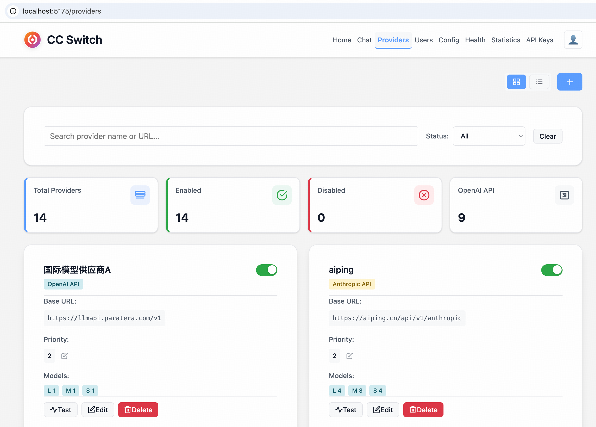
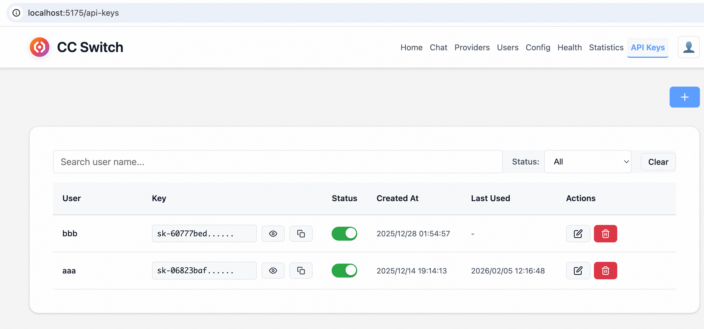
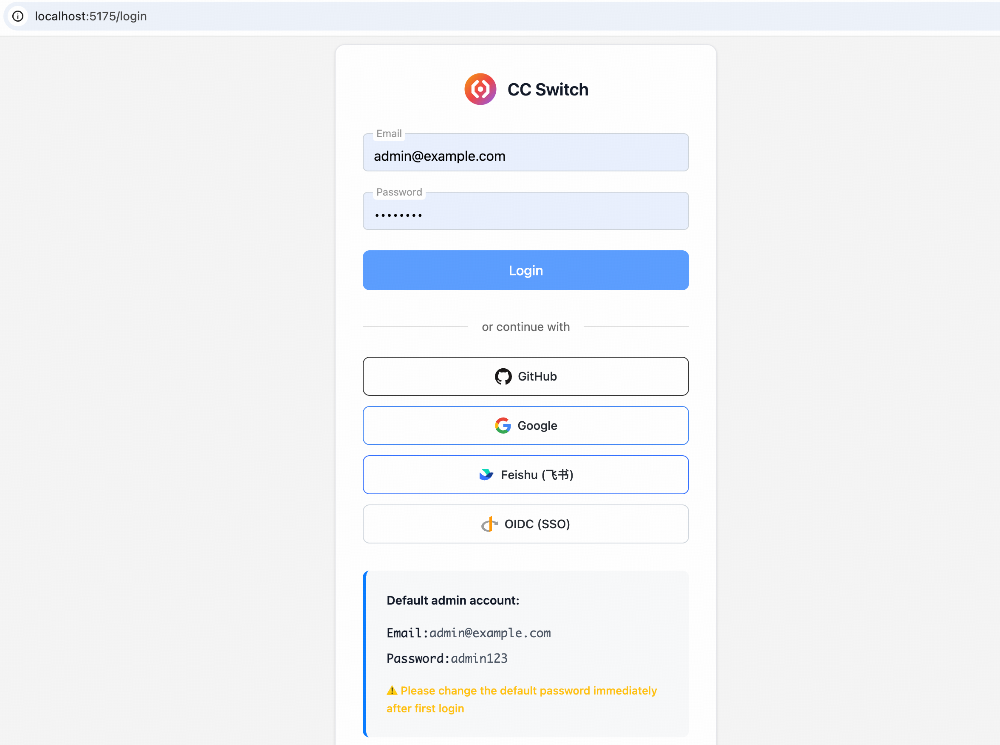

# CC Switch

[](https://github.com/michaelhuang7119/cc-switch/actions)
[](https://opensource.org/licenses/MIT)
[](https://www.python.org/downloads/)
[](https://fastapi.tiangolo.com/)
[](https://svelte.dev/)

> 🌐 **English Documentation** | [English Quick Guide](./README.md) • [English Technical Docs](./docs/README-COMPLETE.md)

一个基于 FastAPI 和 Svelte 5 的高性能 AI 模型代理服务，支持多供应商配置和管理。

## ✨ 项目简介

CC Switch 是一个企业级 API 代理服务，它实现了 Anthropic 兼容的 API 端点，并将请求转发到支持 OpenAI 兼容接口的后端供应商（如通义千问、ModelScope、AI Ping、Anthropic 等）。通过统一的 API 接口，您可以轻松切换不同的 AI 模型供应商，而无需修改客户端代码。

## 🏗️ 项目架构

### 后端结构 (FastAPI + Python 3.11+)

```
backend/app/
├── main.py                    # 应用入口
├── config/                    # 配置管理
│   ├── settings.py            # 主配置 (ProviderConfig, AppConfig 等)
│   └── hot_reload.py          # 使用 watchdog 的配置热重载
├── core/                      # 核心业务逻辑
│   ├── auth.py                # JWT 认证、API Key 验证
│   ├── constants.py           # 常量定义 (API_VERSION, MAX_MESSAGE_LENGTH 等)
│   ├── lifecycle.py           # 启动/关闭事件
│   ├── model_manager.py       # 供应商和模型路由
│   ├── models.py              # Pydantic 模型 (Message, MessagesRequest 等)
│   └── permissions.py         # 权限定义和检查
├── routes/                    # API 路由（统一在 /routes/ 下）
│   ├── messages.py            # /v1/messages 端点
│   ├── auth.py                # /api/auth/* (登录、注册)
│   ├── api_keys.py            # /api/api_keys/* (API Key 管理)
│   ├── providers.py           # /api/providers/* (供应商管理)
│   ├── conversations.py       # /api/conversations/* (聊天历史)
│   ├── health.py              # /api/health/* (健康检查)
│   ├── stats.py               # /api/stats/* (统计数据)
│   ├── config.py              # /api/config/* (配置管理)
│   ├── preferences.py         # /api/preferences/* (用户偏好)
│   ├── event_logging.py       # /api/event_logging/* (事件日志)
│   ├── admin_permissions.py   # /api/admin/permissions/* (用户与权限管理)
│   └── oauth.py               # /oauth/* (OAuth 登录)
├── services/                  # 业务逻辑服务
│   ├── handlers/              # 请求处理器 (OpenAI/Anthropic 格式)
│   │   ├── base.py
│   │   ├── openai_handler.py
│   │   └── anthropic_handler.py
│   ├── message_service.py     # 消息处理和供应商路由
│   ├── health_service.py      # 健康监控服务
│   ├── provider_service.py    # 供应商管理服务
│   ├── token_counter.py       # Token 计数和历史查询
│   ├── config_service.py      # 配置服务
│   └── oauth_service.py       # OAuth 服务
├── converters/                # 格式转换 (Anthropic ↔ OpenAI)
│   ├── anthropic_request_convert.py  # Anthropic → OpenAI 请求转换
│   └── openai_response_convert.py    # OpenAI → Anthropic 响应转换
├── infrastructure/            # 基础设施层
│   ├── clients/               # 供应商 API 客户端
│   │   ├── openai_client.py
│   │   └── anthropic_client.py
│   ├── circuit_breaker.py     # 熔断器模式
│   ├── concurrency_manager.py # 并发控制
│   ├── retry.py               # 指数退避重试
│   ├── cache.py               # 内存/Redis 缓存
│   └── telemetry.py           # OpenTelemetry 集成
├── database/                  # 数据访问层 (异步 SQLite)
│   ├── core.py                # 数据库连接和模式定义
│   ├── users.py               # 用户管理
│   ├── api_keys.py            # API Key 存储
│   ├── conversations.py       # 对话和消息
│   ├── request_logs.py        # 请求日志
│   ├── token_usage.py         # Token 使用统计
│   ├── health_history.py      # 健康历史
│   ├── config_changes.py      # 配置变更历史
│   ├── oauth_accounts.py      # OAuth 账户关联
│   └── encryption.py          # 加密工具
├── utils/                     # 工具函数
│   ├── token_extractor.py     # 统一 Token 提取 (支持 OpenAI/Anthropic)
│   ├── security_utils.py      # 加密、验证、API Key 掩码
│   ├── color_logger.py        # 彩色日志
│   ├── error_handler.py       # 错误响应格式化
│   └── response.py            # 响应工具
└── encryption_key.py          # 加密密钥管理
```

### 前端结构 (Svelte 5 + TypeScript)

```
frontend/src/
├── lib/
│   ├── components/            # 可复用的 Svelte 组件
│   │   ├── chat/              # 聊天相关组件 (ChatArea, MessageBubble 等)
│   │   ├── layout/            # 布局组件 (Header, MobileNav)
│   │   ├── providers/         # 供应商管理组件
│   │   ├── settings/          # 设置组件
│   │   ├── ui/                # 基础 UI 组件 (Button, Input, Card 等)
│   │   ├── i18n/              # 国际化组件 (Translate)
│   │   ├── ErrorMessageModal.svelte
│   │   ├── Pagination.svelte
│   │   ├── ProviderForm.svelte
│   │   ├── SettingsModal.svelte
│   │   ├── WelcomeModal.svelte
│   │   └── OAuthIcon.svelte
│   ├── services/              # API 客户端服务
│   │   ├── api.ts             # 主 API 客户端
│   │   ├── chatService.ts     # 聊天服务
│   │   ├── auth.ts            # 认证服务
│   │   ├── permissions.ts     # 权限管理服务
│   │   ├── oauthProviders.ts  # OAuth 提供商配置
│   │   ├── apiKeys.ts         # API Key 服务
│   │   ├── apiKeyStorage.ts   # API Key 安全存储
│   │   ├── providers.ts       # 供应商服务
│   │   ├── health.ts          # 健康监控服务
│   │   ├── stats.ts           # 统计服务
│   │   ├── config.ts          # 配置服务
│   │   └── preferences.ts     # 用户偏好服务
│   ├── stores/                # Svelte 状态存储 (Svelte 5 $state)
│   │   ├── auth.svelte.ts     # 认证状态
│   │   ├── chatSession.ts     # 聊天会话状态
│   │   ├── providers.ts       # 供应商状态
│   │   ├── health.ts          # 健康状态
│   │   ├── language.ts        # 国际化状态
│   │   ├── theme.ts           # 主题状态
│   │   ├── toast.ts           # Toast 消息状态
│   │   └── config.ts          # 配置状态
│   ├── types/                 # TypeScript 类型定义
│   │   ├── permission.ts      # 权限类型
│   │   ├── apiKey.ts          # API Key 类型
│   │   ├── provider.ts        # 供应商类型
│   │   ├── health.ts          # 健康类型
│   │   ├── config.ts          # 配置类型
│   │   └── language.ts        # 语言类型
│   ├── config/                # 配置文件
│   │   └── keyboardShortcuts.ts  # 键盘快捷键
│   ├── utils/                 # 工具函数
│   │   ├── gesture.ts         # 手势检测
│   │   └── session.ts         # 会话管理
│   └── i18n/                  # 国际化资源文件 (16种语言)
├── routes/                    # SvelteKit 页面
│   ├── +layout.svelte         # 根布局 (认证、权限检查)
│   ├── +page.svelte           # 首页
│   ├── login/                 # 登录页 (支持邮箱 + OAuth)
│   │   └── +page.ts
│   ├── chat/                  # 聊天页面
│   ├── providers/             # 供应商管理
│   ├── api-keys/              # API Key 管理
│   ├── health/                # 健康监控
│   ├── stats/                 # 使用统计
│   ├── config/                # 系统配置
│   ├── admin/
│   │   └── users/             # 用户管理
│   │       ├── +page.svelte   # 用户列表
│   │       └── [id]/          # 用户详情与权限配置
│   └── oauth/
│       └── [provider]/        # OAuth 回调处理
│           └── callback/      # OAuth 回调页面
└── app.html                   # HTML 模板
```

### 请求流程

```
客户端请求
  ↓
API 路由 (/routes/messages.py, /routes/*.py)
  ↓
消息服务 (message_service.py)
  ↓
格式转换器 (converters/)
  ↓
供应商处理器 (services/handlers/)
  ↓
供应商客户端 (infrastructure/clients/)
  ↓
后端 AI 供应商 (OpenAI/Anthropic 格式)
  ↓
响应转换
  ↓
客户端
```

## 🚀 核心功能

- **🔥 高性能架构** - 异步数据库 + 连接池，HTTP 连接池优化，支持 10k QPS
- **🛡️ 企业级安全** - JWT 密钥管理、数据加密存储、强密码策略
- **🔐 多方式认证** - 支持邮箱密码登录 + OAuth 社交登录（GitHub、Google、飞书、Microsoft、OIDC）
- **👥 用户管理** - 完整的用户生命周期管理（创建、编辑、删除、启用/禁用）
- **🛡️ 细粒度权限控制** - 9 个权限点精确控制功能访问，支持按用户配置权限
- **🌍 国际化支持** - 16种语言支持（中文、英文、日文、韩文等）
- **🌐 现代管理界面** - Svelte 5 + TypeScript，PWA 支持，深色/浅色主题
- **🔧 智能管理** - OpenTelemetry 集成，健康监控，自动故障转移，熔断器模式
- **📊 运营监控** - 性能统计，Token 使用追踪，实时日志
- **💬 对话管理** - 历史对话记录，多对话支持，Token 用量统计
- **🏢 多供应商支持** - 统一 API 接口，智能模型映射，供应商 Token 限制

## 🏃‍♂️ 快速开始

### 环境要求

- **Python 3.9+** (推荐 3.11+)
- **Node.js 18+** (推荐 20+)
- **npm/pnpm/yarn** (推荐 pnpm)
- **Docker & Docker Compose** (可选，用于容器化部署)

### 🚀 一键部署（推荐）

#### Docker Compose 方式

```bash
# 克隆项目
git clone https://github.com/MichaelHuang7119/cc-switch.git
cd cc-switch

# 启动所有服务（后端 + 前端）
docker-compose up -d

# 查看服务状态
docker-compose ps

# 查看日志
docker-compose logs -f frontend
docker-compose logs -f backend
```

服务启动后：

- **前端管理界面**: http://localhost:5173
- **API 文档**: http://localhost:8000/docs

#### 本地开发方式

**1. 启动后端服务**

```bash
cd backend
bash start.sh # 如果需保持热重载，可指定为 "开发模式"，即：bash start.sh --dev
```

**2. 启动前端服务（新终端）**

```bash
cd frontend
# bash 启动
bash start.sh # 如果需保持热重载，可指定为 "开发模式"，即：bash start.sh --dev
# npm/pnpm启动（可指定端口）
pnpm install  # or: npm install, 首次运行需要安装依赖
pnpm dev -- --port 5173 # or: npm dev -- --port 5173
```

### 🔑 首次登录

1. 访问前端管理界面：http://localhost:5173
2. 系统会自动跳转到登录页面
3. 使用默认管理员账号登录：
   - **邮箱**：`admin@example.com`
   - **密码**：`admin123`

> **重要**：首次登录后请立即修改密码！生产环境需要设置强密码。

### ⚙️ 配置必需环境变量

**生产环境请设置以下环境变量，以保证数据安全和支持更多的配置**：

```bash
# 必需 - JWT 密钥
export JWT_SECRET_KEY="your-strong-secret-key-here"

# 推荐 - 加密密钥（用于敏感数据加密）
export ENCRYPTION_KEY="your-fernet-encryption-key-here"

# 推荐 - 管理员密码（至少 12 字符）
export ADMIN_PASSWORD="your-secure-password"

# 性能优化 - 数据库连接池
export DB_POOL_SIZE=20
export DB_POOL_TIMEOUT=30.0

# 可选 - 监控配置
export ENABLE_TELEMETRY=true
export OTLP_ENDPOINT=http://jaeger:4318
```

### 🔑 配置 Claude Code

1. **🏢 配置 AI 供应商**：

***可以编辑后端的配置文件***

编辑 `backend/provider.json` 文件：

```json
{
  "providers": [
    {
      "name": "qwen",
      "enabled": true,
      "priority": 1,
      "api_key": "${QWEN_API_KEY}",
      "base_url": "https://dashscope.aliyuncs.com/compatible-mode/v1",
      "timeout": 60,
      "max_retries": 1,
      "models": {
        "big": ["qwen-plus", "qwen-max"],
        "middle": ["qwen-turbo"],
        "small": ["qwen-plus"]
      }
    },
    {
      "name": "anthropic-direct",
      "enabled": true,
      "priority": 2,
      "api_key": "${ANTHROPIC_API_KEY}",
      "base_url": "https://api.anthropic.com",
      "api_format": "anthropic",
      "timeout": 60,
      "max_retries": 1,
      "models": {
        "big": ["claude-3-opus-20240229"],
        "middle": ["claude-3-sonnet-20240229"],
        "small": ["claude-3-haiku-20240307"]
      }
    }
  ],
  "fallback_strategy": "priority",
  "circuit_breaker": {
    "failure_threshold": 5,
    "recovery_timeout": 60
  }
}
```

***或者通过前端配置***




2. **创建 API Key**：

**方式一：使用 cURL 通过后端接口创建**

> 创建 API Key 需要管理员权限，需先获取 JWT Token。

```bash
# 步骤 1：登录获取 JWT Token
curl -X POST http://localhost:8000/api/auth/login \
  -H "Content-Type: application/json" \
  -d '{"email": "admin@example.com", "password": "admin123"}'
```

返回示例：
```json
{
  "access_token": "eyJhbGciOiJIUzI1NiIs...",
  "token_type": "bearer",
  "user": {
    "id": 1,
    "email": "admin@example.com",
    "name": "Administrator",
    "is_admin": true
  }
}
```

```bash
# 步骤 2：创建 API Key
curl -X POST http://localhost:8000/api/api-keys \
  -H "Content-Type: application/json" \
  -H "Authorization: Bearer <你的_JWT_token>" \
  -d '{"name": "my-api-key", "email": "admin@example.com"}'
```

返回示例：
```json
{
  "id": 1,
  "api_key": "sk-abc123...",  // 完整 API Key 仅在此刻返回，请妥善保管
  "key_prefix": "sk-abc1...",
  "name": "my-api-key",
  "email": "admin@example.com",
  "is_active": true
}
```

**方式二：通过前端界面创建**

- 登录管理界面
- 访问「API Key 管理」页面
- 点击「创建 API Key」
- 填写名称和邮箱（可选）
- 复制生成的 API Key（**注意：创建后无法再次查看完整 Key**）



3. **配置 Claude Code 环境变量**：

```bash
# 仅启动后端时（假设后端端口为 8000）
export ANTHROPIC_BASE_URL=http://localhost:8000

# 前后端同时启动时，也可直接通过前端代理访问（前端端口如 5173）
export ANTHROPIC_BASE_URL=http://localhost:5173

# API Key：开发模式下可设为任意值；生产模式下需使用创建的有效 Key
export ANTHROPIC_API_KEY="sk-xxxxxxxxxxxxx"

# Claude Code 模型配置：haiku（小模型）、sonnet（中模型）、opus（大模型）
# 分别对应 provider.json 中的 small、middle、big 三类模型
# 例如：
# export ANTHROPIC_MODEL="sonnet"
# export ANTHROPIC_SMALL_FAST_MODEL="haiku"
# export ANTHROPIC_DEFAULT_SONNET_MODEL="sonnet"
# export ANTHROPIC_DEFAULT_OPUS_MODEL="opus"
# export ANTHROPIC_DEFAULT_HAIKU_MODEL="haiku"
```

### 🔐 配置 OAuth 登录（可选）

系统支持多种 OAuth 提供商进行社交登录。配置相应的环境变量即可启用：

```bash
# GitHub OAuth
export GITHUB_CLIENT_ID="your-github-client-id"
export GITHUB_CLIENT_SECRET="your-github-client-secret"

# Google OAuth
export GOOGLE_CLIENT_ID="your-google-client-id"
export GOOGLE_CLIENT_SECRET="your-google-client-secret"

# 飞书 OAuth（企业微信）
export FEISHU_CLIENT_ID="your-feishu-client-id"
export FEISHU_CLIENT_SECRET="your-feishu-client-secret"

# Microsoft OAuth（Azure AD）
export MICROSOFT_CLIENT_ID="your-microsoft-client-id"
export MICROSOFT_CLIENT_SECRET="your-microsoft-client-secret"
export MICROSOFT_TENANT_ID="common"  # 或特定 tenant ID

# 通用 OIDC（支持 Logto、Keycloak、Authentik 等）
export OIDC_CLIENT_ID="your-oidc-client-id"
export OIDC_CLIENT_SECRET="your-oidc-client-secret"
export OIDC_AUTHORIZATION_URL="https://your-oidc-server/oauth/authorize"
export OIDC_TOKEN_URL="https://your-oidc-server/oauth/token"
```

配置完成后，登录页面将显示对应的 OAuth 登录按钮。



## 📚 API 使用示例

### 基础消息请求

```bash
# 可直接访问后端（http://localhost:8000/v1/messages）
# 或通过前端代理（http://localhost:5173/v1/messages）
curl -X POST http://localhost:8000/v1/messages \
  -H "Content-Type: application/json" \
  -H "X-API-Key: sk-xxxxxxxxxxxxx" \
  -d '{
    "model": "haiku",
    "messages": [{"role": "user", "content": "你好！"}],
    "max_tokens": 100
  }'
```

### 流式请求

```bash
# 可直接访问后端（http://localhost:8000/v1/messages）
# 或通过前端代理（http://localhost:5173/v1/messages）
curl -X POST http://localhost:8000/v1/messages \
  -H "Content-Type: application/json" \
  -H "X-API-Key: sk-xxxxxxxxxxxxx" \
  -d '{
    "model": "sonnet",
    "messages": [{"role": "user", "content": "给我讲个故事"}],
    "max_tokens": 200,
    "stream": true
  }'
```

### 工具调用（Function Calling）

```bash
# 可直接访问后端（http://localhost:8000/v1/messages）
# 或通过前端代理（http://localhost:5173/v1/messages）
curl -X POST http://localhost:8000/v1/messages \
  -H "Content-Type: application/json" \
  -H "X-API-Key: sk-xxxxxxxxxxxxx" \
  -d '{
    "model": "opus",
    "messages": [{"role": "user", "content": "北京今天天气怎么样？"}],
    "max_tokens": 200,
    "tools": [{
      "name": "get_weather",
      "description": "获取指定城市的天气信息",
      "input_schema": {
        "type": "object",
        "properties": {
          "location": {
            "type": "string",
            "description": "城市名称"
          }
        },
        "required": ["location"]
      }
    }]
  }'
```

## 📊 监控和统计

### 查看健康状态

```bash
# 可直接访问后端（http://localhost:8000/health）
# 或通过前端代理（http://localhost:5173/health）
curl http://localhost:8000/health
```

### 获取 Token 使用统计

```bash
# 可直接访问后端（http://localhost:8000/api/stats/token-usage）
# 或通过前端代理（http://localhost:5173/api/stats/token-usage）
curl -H "Authorization: Bearer <your-jwt-token>" \
  http://localhost:8000/api/stats/token-usage
```

### 查看请求日志

```bash
# 可直接访问后端（http://localhost:8000/api/stats/requests）
# 或通过前端代理（http://localhost:5173/api/stats/requests）
curl -H "Authorization: Bearer <your-jwt-token>" \
  http://localhost:8000/api/stats/requests
```

## 🌐 更多信息

### 📚 开发资源
- 🔧 **[开发指南](docs/DEVELOPMENT-zh.md)** - 详细的开发指南、架构说明、API 文档
- 📖 **[完整技术文档](docs/README-COMPLETE-zh.md)** - 完整技术文档

### 🌐 API 与演示
- 🔗 **[交互式 API 文档](http://localhost:8000/docs)** - 完整的交互式 API 文档
- 🎮 **在线演示** - (待添加)

### 🐛 支持与问题反馈
- 📝 **[问题反馈](https://github.com/michaelhuang7119/cc-switch/issues)** - 报告问题和功能请求

### 🇺🇸 英文资源
- 📄 **[English Quick Guide](README.md)** - 英文版说明文档
- 📘 **[English Technical Docs](docs/README-COMPLETE.md)** - 完整英文技术文档

## 📝 更新日志

### (2026-01-03) - 用户认证与权限管理增强

- **OAuth 多提供商支持**：新增 GitHub、Google、飞书、Microsoft、OIDC 五种 OAuth 登录方式
- **用户管理系统**：完整的用户 CRUD 操作，支持分页、搜索、启用/禁用
- **细粒度权限控制**：9 个权限点（chat、conversations、preferences、providers、api_keys、stats、health、config、users）
- **按用户权限配置**：支持为每个用户单独配置权限，管理员拥有所有权限
- **前端权限路由保护**：未授权用户访问受限页面将自动重定向
- **API Key 管理增强**：安全存储、完整 Key 一次性展示、一键复制

### (2025-11-29) - 国际化与用户体验全面提升

- **新增 16 种语言支持**：中文、English、日本語、한국어、Français、Español、Deutsch、Русский、Português、Italiano、Nederlands、العربية、हिन्दी、ไทย、Tiếng Việt、Bahasa Indonesia
- **智能语言切换**：支持顶部导航栏一键切换语言，自动记忆用户偏好
- **全面本地化**：所有页面、表单、按钮、提示信息、Toast 消息完整翻译
- **修复聊天时间戳**：解决 "Invalid Date" 问题，支持多种时间格式
- **Svelte 5 升级**：全面升级到 Svelte 5 语法，使用 `$state()` 和 `$derived()` 等新特性

## 🤝 贡献

我们欢迎所有形式的贡献！请阅读 **[📘 开发指南](docs/DEVELOPMENT-zh.md)** 中的"**贡献指南**"章节了解详细信息。

## 💖 支持项目

如果这个项目对你有帮助，欢迎通过以下方式支持我们的开发工作！

您的支持将帮助我们：
- 🚀 持续开发和优化功能
- 🐛 快速修复问题
- 📚 完善文档和示例
- 🌍 添加更多语言支持
- ☕ 让开发者保持动力

<div align="center">

### 赞助我们

<table>
  <tr>
    <td align="center">
      <strong>支付宝</strong><br>
      <br>
      <sub>扫描二维码赞助</sub>
    </td>
    <td align="center">
      <strong>微信支付</strong><br>
      <br>
      <sub>扫描二维码赞助</sub>
    </td>
  </tr>
</table>

**感谢每一份支持！** 🙏

</div>

## 📄 许可证

本项目采用 [MIT 许可证](./LICENSE)。

## ⭐ 致谢

感谢所有为这个项目做出贡献的开发者！

---

<div align="center">

**[文档](docs/README-COMPLETE-zh.md)** |
**[开发指南](docs/DEVELOPMENT-zh.md)** |
**[问题反馈](https://github.com/michaelhuang7119/cc-switch/issues)** |
**[更新日志](CHANGELOG.md)**

Made with ❤️ by the CCS Team

</div>
